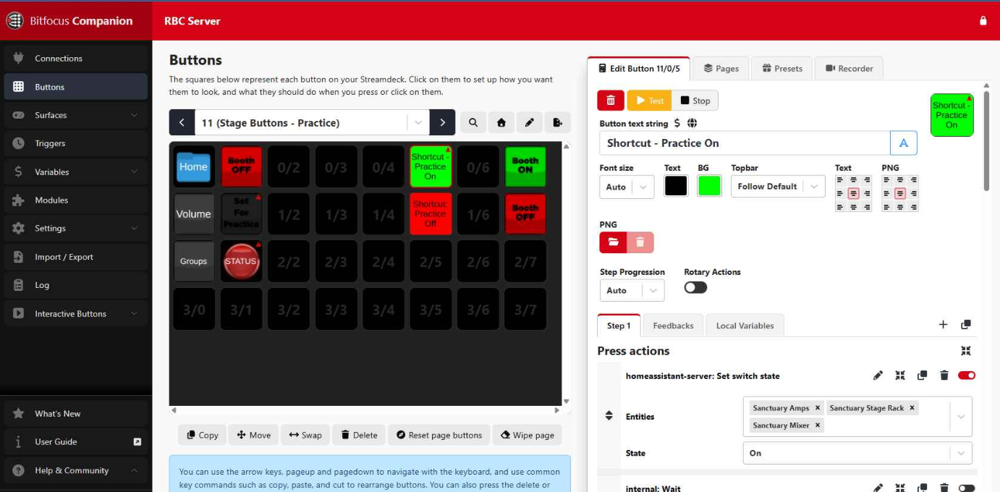
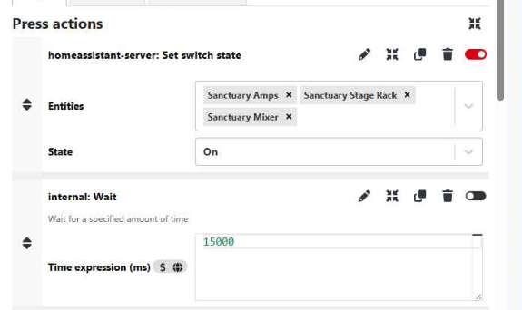
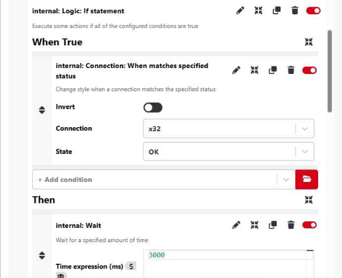
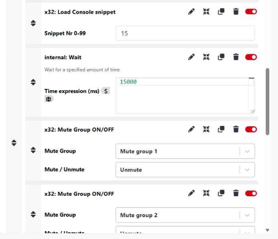
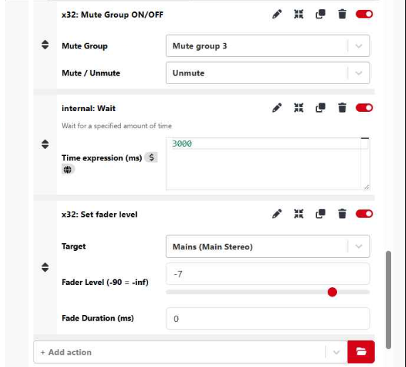
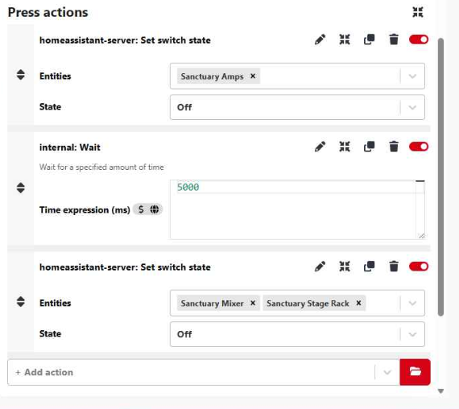
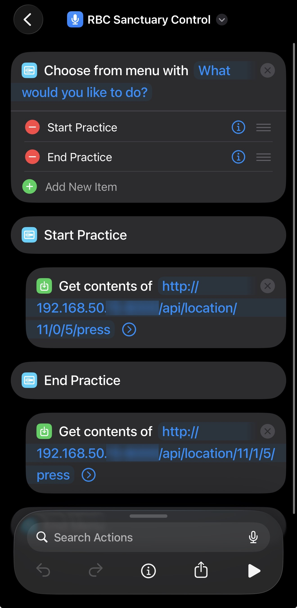
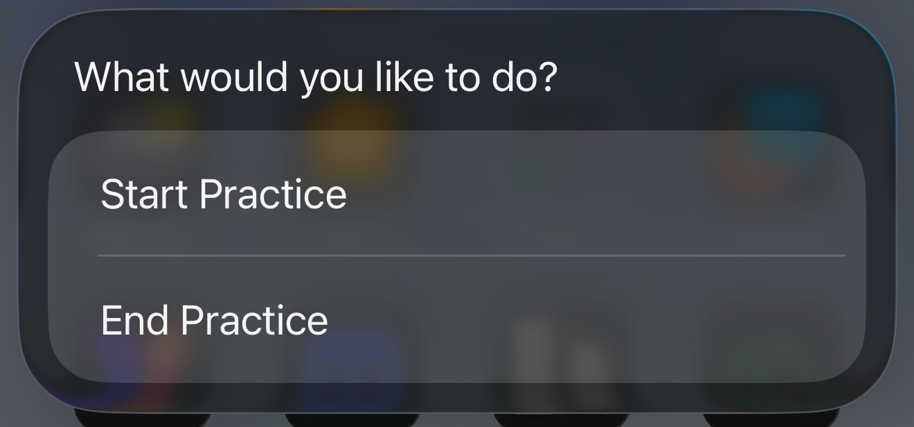

I'm a big fan of automation and trying to make things easier for others. A project I have been working on lately is setting up some automations in Ridgeview's sanctuary. My recent addition to the system is allowing myself or our worship leader to turn on the whole audio system from our phones using Apple Shortcuts. 

One push of a button starts a sequence of turning on power, turning on our audio mixer, and setting levels for worship team practice.

## The Hardware

To accomplish this, we are using some TP-Link Smart Plugs. These are connected to our wireless network, pair with TP-Link's app, and then can be controlled by Home Assistant and Bitfocus Companion. These are simple plugs that we plug each device into. We have one on our amp rack, one on our stage box, and one on our mixer. This allows us to turn them on and off from the TP-Link app and through Bitfocus Companion.

## The Software

[Bitfocus Companion](https://bitfocus.io/companion) is the heart of our production automation systems. This is a piece of software that can connect to tons of different production equipment and programs. We use this as our main video switcher for our vMix system and are getting ready to deploy it for some stage control buttons. (Blog post coming soon)

Companion can connect to Elgato Streamdeck devices and have physical buttons to control these production systems, but I recently learned that it can be controlled by HTTP requests and in turn, Apple Shortcuts from my phone.

The other piece that we are using is [Home Assistant](https://www.home-assistant.io/) which is meant to be a home automation platform but I like running it at church because it connects to all of our Internet of Things (IoT) devices like these smart plugs, our network equipment, or thermostats. Once it has connections to these devices, you can build dashboards with all the different devices in one program. Currently we are just using it for a few small dashboards to see everything at once, but I'm also triggering devices through Companion with it because their integration works so well.

We are able to add plugins into Companion to connect to our Home Assistant server and also our Midas M32 sound mixer.

## Startup Automation

Inside of Companion, we have a page for our stage control buttons that we are installing. I also have 2 buttons that are not shown on that device that I am using for these automation controls.

There is a button for turning the system on and turning the system off. For the startup procedure we begin by setting the switch state in Home Assistant for our 3 devices which will start powering everything up. We then wait 15 seconds for the sound mixer to boot up.

After checking that Companion has a connection to the mixer, we can begin setting everything up for practice.

After this, we wait another 3 seconds and then we load snippet number 15. This snippet on our mixer has our band and vocal mics at a normal level for practice, so no matter what level they may have been for the last service, they will be reset to a known good mix for practice.

Once that snippet is loaded, we wait another 15 seconds since it takes a bit for each channel to update. Once that timer is up, we unmute our 3 mute groups (band, vocals, worship leader) to unmute all of their channels for practice.

Once everything is unmuted, we wait another 3 seconds for that to finish and then set the main volume fader to -7 dB for practice.

After all of these steps, it takes about 40 seconds and the band is ready to practice with everything turned on. 

## Shutdown Automation

Similarly, we have a button for shutting everything down. This button turns off the amps, waits 5 seconds, and then turns off the mixer and stage rack. We turn off the amps first to prevent a pop sound when the mixer and rack turn off.

## Setting up the Apple Shortcut

Using the Apple Shortcuts app, we are able to run commands to tell Companion to simulate button presses to control our power sequence.

To begin the shortcut, we present a quick menu to let the person start or stop practice. This also helps to prevent accidental changes.

Depending on which button is clicked, the shortcut does a POST request to our Companion server IP with the URL for pressing the button. Using Companion's HTTP requests we can give it a specific button on a specific page. For example, our start button is page 11, row 0, column 5, and Companion handles the rest. 

So the shortcut just pushes a button and Companion does all of the work. When we run the shortcut, we get a simple menu popped up and can start or stop practice.

## Conclusion

This was a simple addition to the automation we already rely on, but it has made a real difference for our worship leader. What I like most about this setup is that no extra hardware was needed. Companion, Home Assistant, and the smart plugs were already in place. Apple Shortcuts just gave us a clean way to trigger it all from a phone. One tap and everything is ready to go, or shut down, without anyone needing to touch a computer or know how any of it works under the hood.