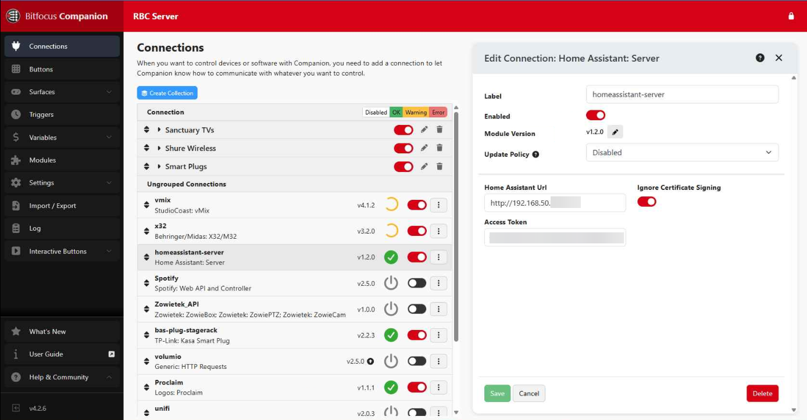

I'm a big fan of automation and trying to make things easier for others. A project I have been working on lately is setting up some automations in Ridgeview's sanctuary. My recent addition to the system is allowing myself or our worship leader to turn on the whole audio system from our phones using Apple Shortcuts. 

One push of a button starts a sequence of turning on power, turning on our audio mixer, and setting levels for worship team practice.

## The Hardware

To accomplish this, we are using some TP-Link Smart Plugs. These are connected to our wireless network and then to Bitfocus Companion. These are simple plugs that we plug each device into. We have one on our amp rack, one on our stage box, and one on our mixer. This allows us to turn them on and off from the TP-Link app and eventually Bitfocus Companion.

## The Software

[Bitfocus Companion](https://bitfocus.io/companion) is the heart of our production automation systems. This is a piece of software that can connect to tons of different production equipment and programs. We use this as our main video switcher for our vMix system and are getting ready to deploy it for some stage control buttons. (Blog post coming soon)

Companion can connect to Elgato Streamdeck devices and have physical buttons to control these production systems, but I recently learned that it can be controlled by HTTP requests and in turn, Apple Shortcuts from my phone.

The other piece that we are using is [Home Assistant](https://www.home-assistant.io/) which is meant to be a home automation platform but I like running it at church because it connects to all of our Internet of Things (IoT) devices like these smart plugs, our network equipment, or thermostats. Once is has connections to these devices, you can build dashboards with all the different devices in one program. Currently we are just using it for a few small dashboards to see everything at once, but I'm also triggering devices through Companion with it because their integration works so well.

We are able to add plugins into Companion to connect to our Home Assistant server and also our Midas M32 sound mixer.

## Apple Shortcuts