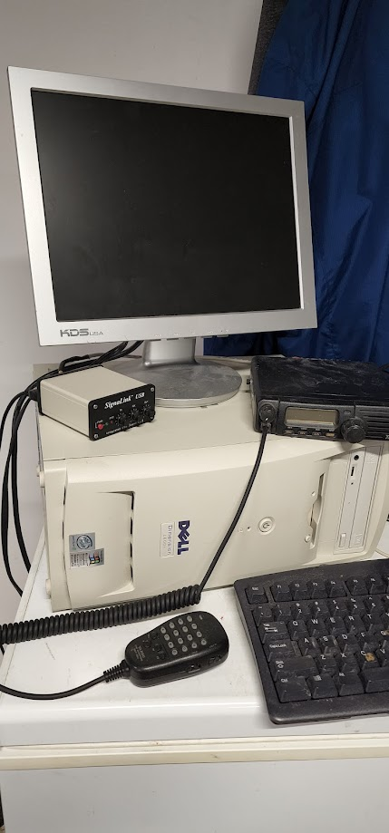
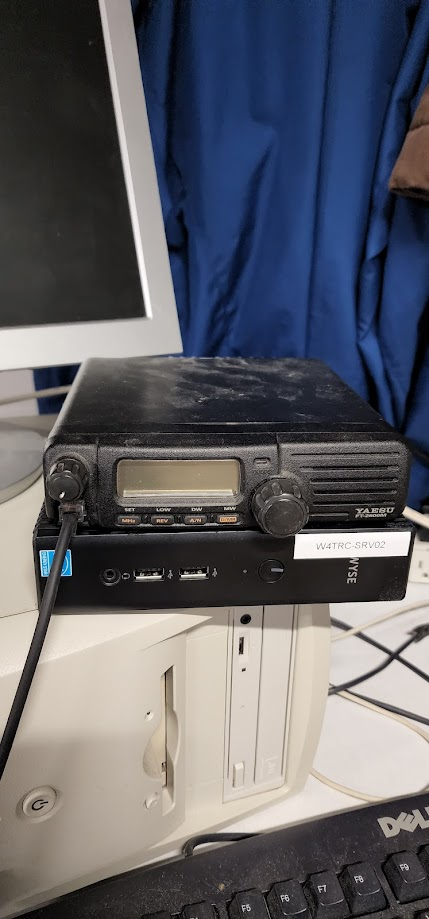
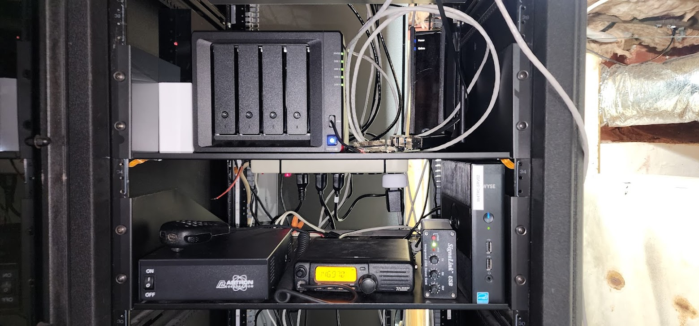
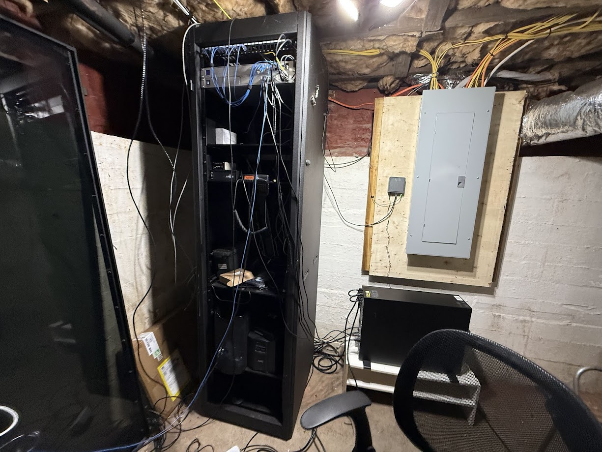
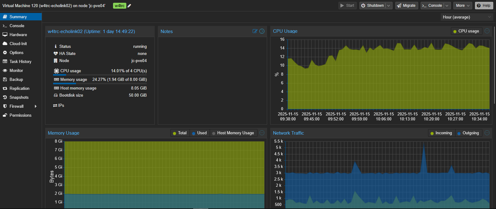
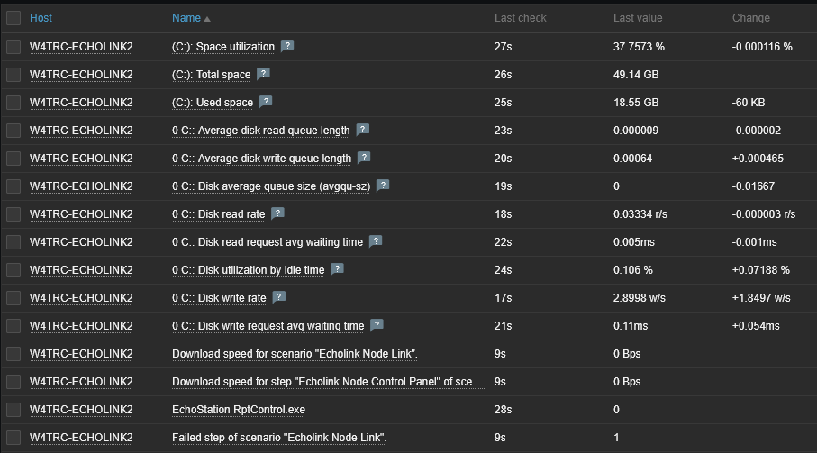
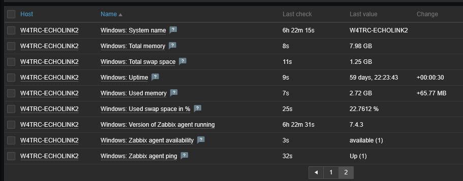
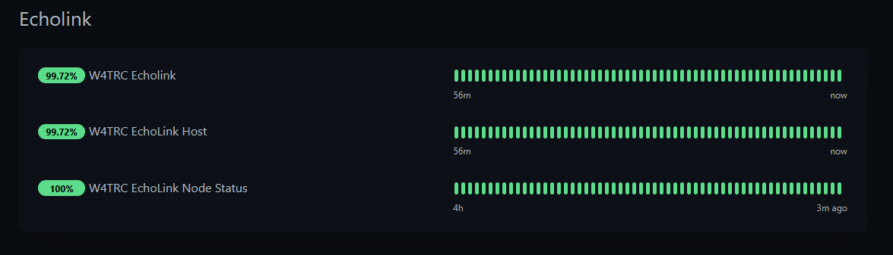
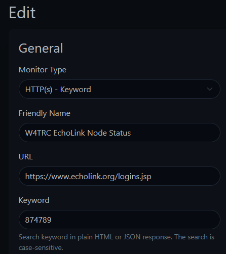

I run a system called EchoLink that allows any amateur radio operator to connect to our repeater on Bays Mountain.

## What is EchoLink?

[EchoLink](https://echolink.org/) allows licensed amateur radio operators to connect to radios, repeaters, and conferences over the internet. Using your phone or a computer program, you can simply select any station that is online and connect to it and talk on that connection. Some of the stations are online only and some connect to repeaters like ours.

For Kingsport Amateur Radio Club, if you search W4TRC/R you will find our repeater link. If you connect to this in EchoLink you are connecting to a radio in my basement which is programmed to transmit to our repeater on Bays Mountain. This allows you to be anywhere in the world, connect to our repeater, and talk with anyone over radio in the Tri-Cities area.

## Why EchoLink?

Much of amateur radio is about emergency communications, though this is not an emergency communications method, it's just a nice thing to have. This system is reliant on the internet connection and power staying online at my house, so in a storm there is a chance it may not work.

Why do we run this? It's to allow people out of range of our repeater to use it to check into our nets or talk to their friends. We run a [Sunday Night Net](https://w4trc.org/nets) to pass traffic, have discussions, receive help, and sell items. This allows people to continue to check in and participate if they are not near a radio or out of the range of our repeater.

## Why my house?

I volunteered to run the EchoLink system because I love dealing with networks and servers and also radios, so this was a good match. I also live right in downtown Kingsport below our tower so I can run the radio on a low power and still hit the repeater just fine.

## The Setup

The EchoLink station got handed to me as a Windows XP computer, radio, and power supply.

I immediately replaced it with a small form factor PC running Windows 10. 

It ran like this for a year or so at my parents' house until I moved. When I moved it stayed on the SFF PC for a bit until I got my new server in place.

When I got my new server in place, I decided to virtualize the actual EchoLink server.

The SFF PC was retired and I set up a Windows 11 virtual machine on my main server running Proxmox. 

## The Setup on Proxmox

I run Proxmox for my homelab and also some production servers so running EchoLink on it was a no-brainer. Proxmox runs as the operating system on the physical server but lets you run many virtual machines on it. 

### Why Proxmox?

Running this on Proxmox gives me such flexibility to easily make changes and take backups of EchoLink easily. I can take a snapshot before running an update so if the update goes wrong, I can revert back to before the update easily. This also lets me run it on existing hardware and not need more computer equipment running.

From the web interface of Proxmox, I can see the server specs and easily troubleshoot and manage EchoLink from anywhere.

## Monitoring EchoLink

One of the things I enjoy doing is monitoring services I run and EchoLink is no exception. I use my main monitoring stack of [Zabbix](/posts/monitorallthethings/) and UptimeKuma for monitoring and alerting.

### Zabbix

Zabbix has an agent that is installed on the Virtual Machine that monitors the performance of the system such as uptime, CPU uage, and memory usage. This will give me alerts as soon as a problem is detected on the system. Below are just a few of the data points being monitored and that can send alerts.

### Uptime Kuma

Uptime Kuma is running on a cloud server and monitors EchoLink externally. I mainly use this for a public status page that shows up to date information regarding the status of the services. Anyone can view this page at [https://uptime.joshuacarmack.com/status/w4trc](https://uptime.joshuacarmack.com/status/w4trc).

In the EchoLink section there are 3 monitors. The top one is the entire system status. The middle one is the EchoLink host which is the virtual machine. EchoLink provides an admin section for us to manage it remotely so this is monitoring that admin page and checking if it is accessible and Uptime Kuma can log into it. This tells me if that server is running or not. It also checks the admin settings to see if EchoLink is disabled or enabled. We can turn off the link if there are problems or abuse going on, so the server may be running but the link may be disabled. This will show if the link is disabled.

The last item is the EchoLink Node Status. The EchoLink software can be running and enabled, but not connected to EchoLink's systems. This monitor checks EchoLink's public current logins page at [https://www.echolink.org/logins.jsp](https://www.echolink.org/logins.jsp). This listing shows all nodes connected to EchoLink. Uptime Kuma lets me query that page and see if our node number (874789) is in the list. If it is, I know our node is connected and working. If not, there may be an issue with EchoLink's servers. 

This is done with a simple HTTP(s) - Keyword montior as below.

Using Uptime Kuma also lets me have a public badge of the status of the entire EchoLink system on our website at https://w4trc.org. At the very bottom and on our repeater page you can always see the overall status of EchoLink.

## Conclusion

EchoLink is a fun project to run and it helps our community and club members to be able to use our equipment no matter where they may be.

Interested in amateur radio? Check out Kingsport Amateur Radio Club at [w4trc.org](https://w4trc.org).