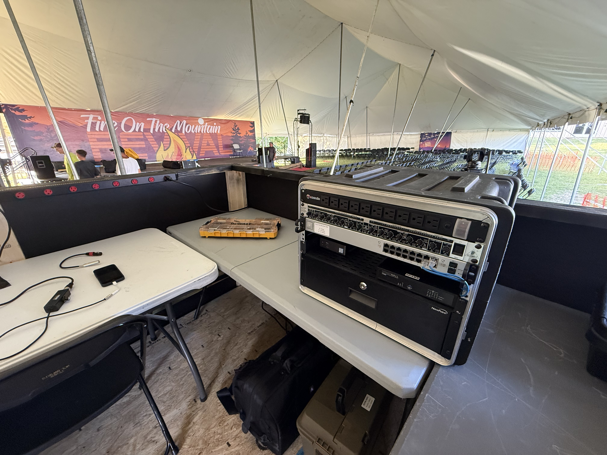
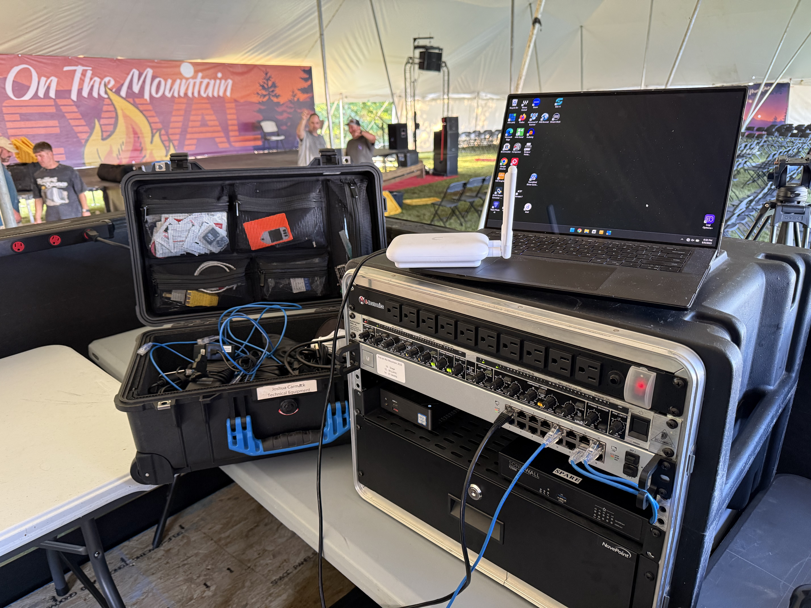
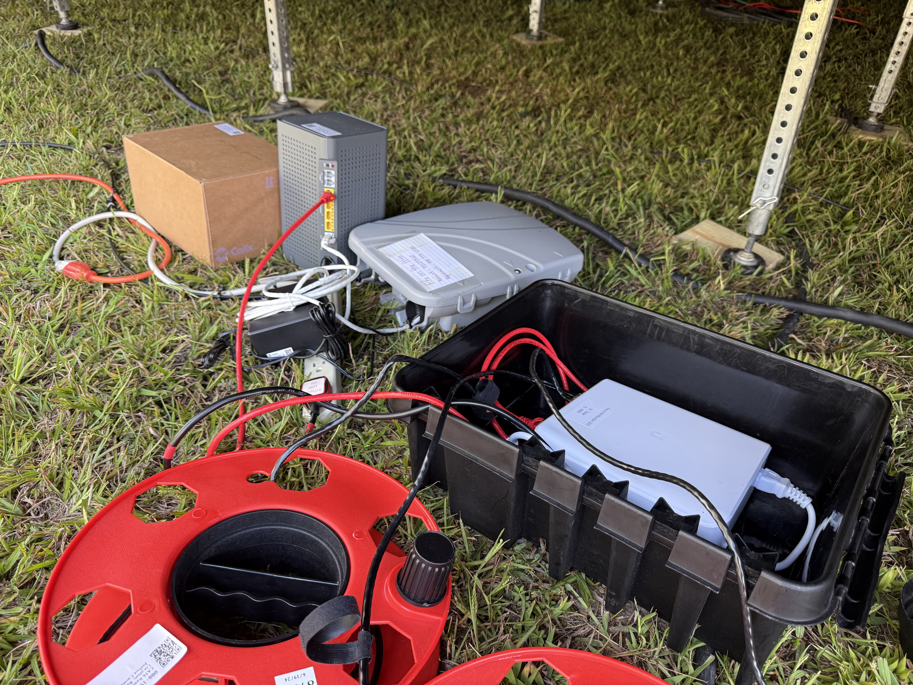
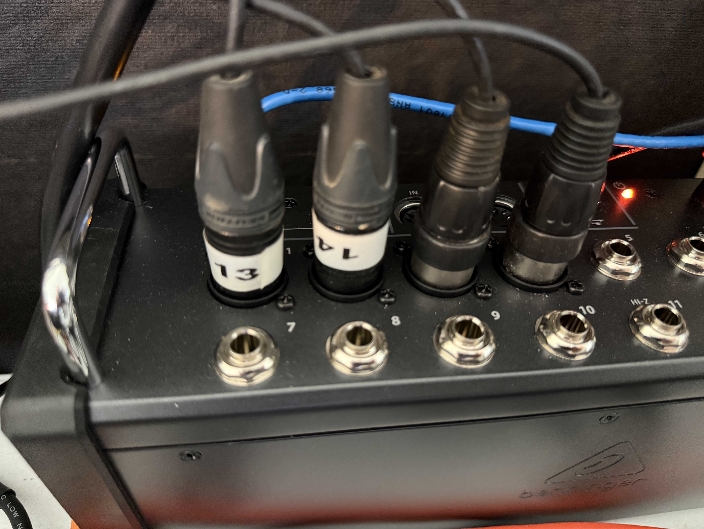
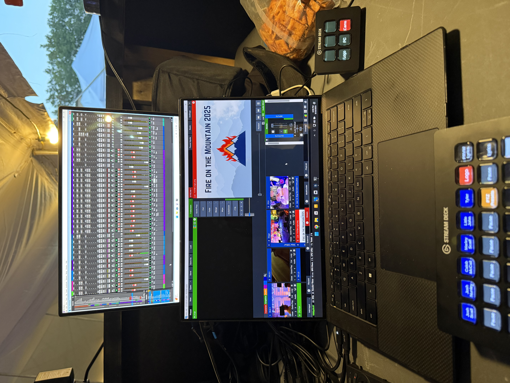
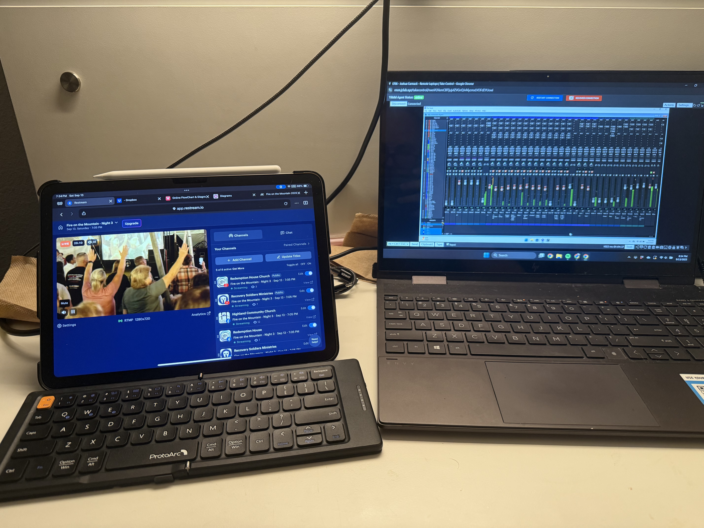

Every year my wife Meg and I go down to Grundy County, Tennessee with [Recovery Soldiers Ministries](https://recoverysoldiersministries.org/) to their Fire on the Mountain tent revival. Meg is in their worship team and I help out with their tech team at times but during Fire on the Mountain, I’m in charge of providing the live stream. I’ve done this for the past 3 years and this year was the smoothest and quickest setup we have had so I wanted to document it and maybe share some tips and tricks of things I have learned along the way.

## Control Area

In the past, we have worked out of a small food truck trailer which worked but was cramped between me, the audio mixer, and lyrics operator. This year they built us a front of house platform which was so much better. There was room to walk around and not bump into each other.

## Networking

The main component of the whole setup is the network that I bring in. Almost everything in my streaming setup is network based so a properly setup network is key.

The main internet connection is brought in by Ben Lomand Connect and they drop a fiber ONT and a wireless router under our stage. They provide a free WiFi for anyone attending but they let us plug into their router for a hard wired connection for our production equipment. 

See below diagram of our network and I'll explain more in depth about how it's set up and why I did it this way.


flowchart LR
    ISP[Ben Lomand Connect Router]
    ISP --> SS[Stage Switch]
    SS --|Untag 1, Tag 99|--> FOH[FOH Switch]
    FOH --|U1|--> SW[Firewall]
    FOH --|U99|--> SW
    FOH --> Mini[Mini FOH Switch]
    Mini --> iMac[Presentation iMac]

    FOH --> AP((Access Point))

    POV([POV Camera]) --> SS
    S1([Static Stage Camera]) --> SS
    PTZ([PTZ Camera]) --> SS
    WLS1([Wireless Cam 1]) -.-> AP
    WLS2([Wireless Cam 2]) -.-> AP


### Stage Switch

The first part of the production network is the Stage Switch that is under the stage. Our ISP connects into this switch and rides a WAN VLAN back to Front of House (FOH). The main reason for this is so I only have to run one cable between the stage and Front of House, or where the rest of the equipment is. Also on this switch are a few cameras. All of the cameras that we run for the event are networked and PoE powered. This lets us keep cabling clean and have quick setup/teardown processes.

### FOH Switch

The stage switch plugs into the FOH Switch. This is in a rack next to the stream operating position and has the rest of the network devices. The WAN VLAN terminates here and goes into our firewall.

### Firewall

I set up an old SonicWALL firewall for our production network, just so I can have my own DHCP scope and pre-set static IPs on cameras and devices ahead of time. This lets me do a majority of the prep and programming at home and know it will all work. 

### Access Point

This year I ran just one Unifi UK-Ultra AP at front of house, this was for devices like my phone and tablet to connect to, but also for our two wireless cameras as they are networked as well.

## Audio - Main Stream Feed

In the past few years we have been very simple for audio, taking a AUX feed from the front of house console and relying on bugging the FOH mixer to make adjustments for the stream.

This year I decided to mix my own stream audio completely. The FOH console is a Allen & Heath QU-32 which can let me connect a computer via USB and get multi-track audio from it. This ran into my second laptop running Pro Tools and using Luke Hendrickson's broadcast template (https://productiononline.com/luke-hendricksons-broadcast-template/). 

Luke's template is fantastic and gives a great base mix using some plugins for EQ/compression/effects. This lets me mix completely independently from the in-person mix and provide a clear and high quality sound on the live stream.

From the Pro Tools PC it routes a single mono channel back to the mixer and out through an AUX feed into a PreSonus Studio 26c 2x4 USB audio interface on my streaming PC into vMix.


flowchart LR
    QU[A&H QU-32 Mixer]
    ML[Mixing Laptop (Pro Tools)]
    PS[PreSonus Studio 26x Interface]
    
    QU --|USB - 32 channels|--> ML
    ML --|USB - 1 channel|--> QU
    QU --|XLR - 1 channel|--> PS
    PS --|USB|--> ML


### Audio - Crowd/Stage Mics

In addition to the multitracked audio I mixed, I also ran a Behringer X-Air 12 mixer just for my crowd and stage mics. Our audio engineer was super helpful and let me borrow 4 channels on his audio snake from the stage to FOH. From there I ran these into my X-Air mixer. 

From here I was able to set 2 cardoid microphones on the corner of the stage to hopefully capture the crowd singing and just general room tone. I also ran a shotgun microphone pointed at the stage because they tend to do skits or have the program choirs singing and they aren't mic'd. So with this shotgun microphone I was able to capture it enough to make it not dead silent on live stream.

The microphone wasn't in the best spot but I wanted it out of the way and hidden, so it worked enough for me.

## Streaming PC

The streaming PC is a Dell XPS 15 9250 (i7-12700H, 32GB RAM, 1TB SSD, RTX 3050 laptop GPU) running vMix. vMix handles all of our camera inputs, PC graphics and lower thirds, audio, and this year it handles our projector outputs.

### ME2 - Projection

Due to some issues with the iMac they were using and the HDMI adapters we had, I decided to run the projector output through a second mix engine (ME) in vMix. This was a nice feature to have because we could click a button and change the projector output between the iMac screen or the live stream output to show our cameras on the screens.

## Cameras

We used a mix of my cameras, RSM's camera, and a camera I borrowed from my church. The primary cameras were our two wireless cameras but we had a stationary and a PTZ camera as well to give some other angles and flexibility.

### Wireless Cameras

Our wireless cameras were our best ones, they were 2 identical Z CAM E2s with Olympus M.Zuiko 40-150mm (F4.0-5.6) lenses and Z CAM's IPMAN transmitters. These cameras have a Micro 4/3 sensor and do great in low-light situations. They are completely battery powered and wireless so they gave us fantastic flexibility to have a camera anywhere under the tent at any time. Due to some issues with our headsets and tripod, we only ran 1 as a mobile camera and left the other manned in the back center of the tent on a platform. 

The stationary camera relied on a tally light to see when they were live and some mutual understanding rules of what kind of shots to get. The mobile camera was on a headset with myself or Nick who filled in for me one night. 

RSM likes to have a lot of personal moments on the live stream such as people worshipping or praying and having the 2 manned cameras lets us pick up those moments and be able to share them and make viewers of the stream feel like they are under the tent in person.

### Stationary Cameras

Our stationary cameras are AIDA Imaging POV box cameras. I ended up only putting one up due to time constraints but was happy with how everything worked out so it wasn't added later. These cameras have small sensors but work well for wide angles so we used one off-center as a stage static camera.

### PTZ Camera

My new camera for this year was an OBSBOT Tail Air camera. This is a little 4K pan/tilt/zoom webcam but they sell an NDI adapter for it. I mounted this on a pole that was almost dead center of the stage and only maybe 10-12 feet from where the pastor would be. 

This turned out to be my favorite camera. Even though it only has a 4x digital zoom, it still was able to give us clear shots of the whole stage, the altar, and wide shots of the entire tent. The camera has some AI tracking which worked way better than I expected. We used it a few times, but mainly relied on the main manned camera for our follow shots.

## vMix Setup

Inside of vMix everything comes in as separate inputs and this lets me do my color adjustments and make sure everything is looking the best it can.

## Controls

To control all of these I used 2 Elgato StreamDecks, a 32-key and a 6-key. The 32-key was the main switcher panel while the 6-key was for the second ME and let us have quick buttons to change what input was sent to the projectors.

## Proxmox Server

TODO: add

## Final Review

Overall this year was the best setup we have had.

On night 4, I ended up sick and had to stay in the hotel. Thankfully Meg was able to take my laptops and hand them off to Nick who I FaceTimed and was able to walk him through setting everything up. He was able to run the stream there and I assisted with some streaming audio changes remotely. 

This is one of the main reasons I love having everything computer and network based. Sometimes it can be a bit more complicated due to software issues and my laptop getting a bit overheated, but overall I think it is worth it due to the ease of setup and use.

### What would I change for next year?

#### 10-gig networking (or at least 2.5-gig)

I would like to have a 10-gig capable switch at FOH and run all my cameras to there. They are all 1-gig but having a 10Gb link to my computer would help it be able to receive more data from the cameras.

#### Better streaming PC

One of the issues I encountered this year was maxing out the GPU on my laptop. Having 17 inputs in vMix is about the max that laptop will support and it was still having some glitches even when pausing unused inputs.

#### External switch for the projection

I will probably invest in a simple or cheap HDMI switch where we can run the stream output and the presentation computer to it and be able to switch between them on dedicated hardware and offload that processing from my streaming system.