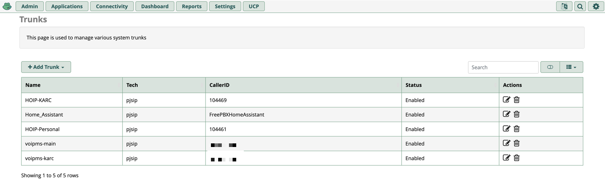

Why set up a home PBX? I don't know... I just did it anyways...

The real answer was I wanted to explore Hams Over IP (https://hamsoverip.com)

# What is a PBX?

# Setting up FreePBX

## Architecture 
- Extensions for each
- Hard phone
- Trunks

# Trunks from Voip.ms
Personal and KARC - separate DIDs on separate trunks
- used callcentric but FreePBX could not differ these DIDs and route them individually, had to swap to Voip.ms for individual trunks as sub accounts
- Cheap numbers

# Trunks from Hams Over IP
- one for personal (104461) and one for club (104469), each come in as a trunk
-- match DIDs for routing
-- make notes about weirdness for outbound trunks

# Home Assistant SIP trunk
- integration to HA for voice assistant

# Physical Phone - Fanvil
- Image of phone
- Configuration notes

# Action URLs