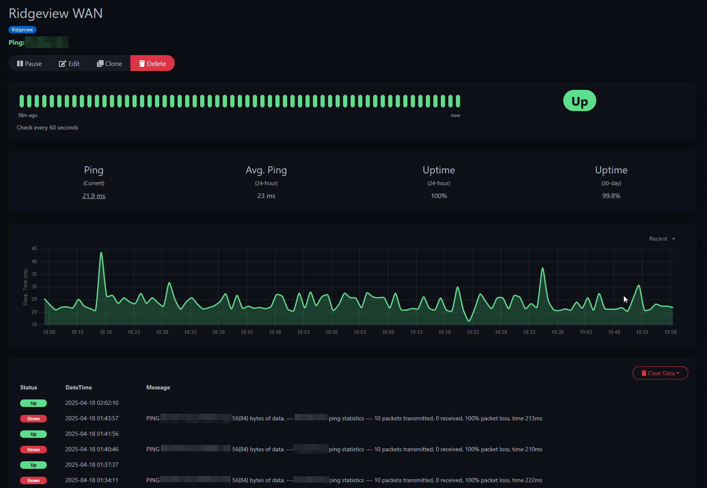
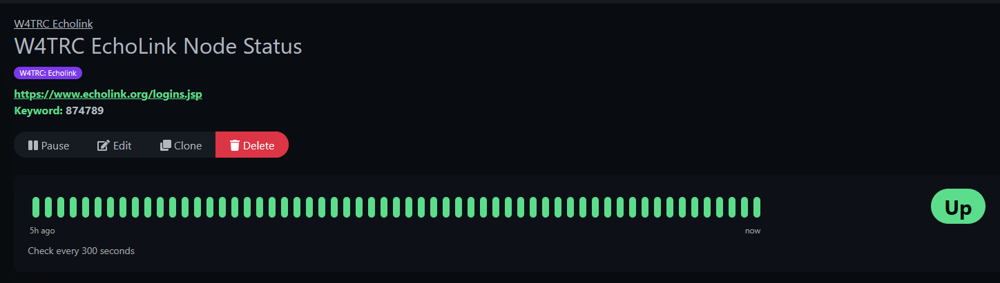
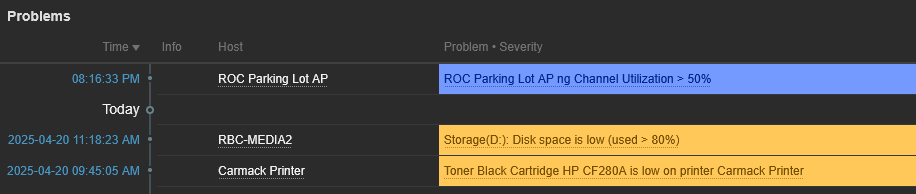
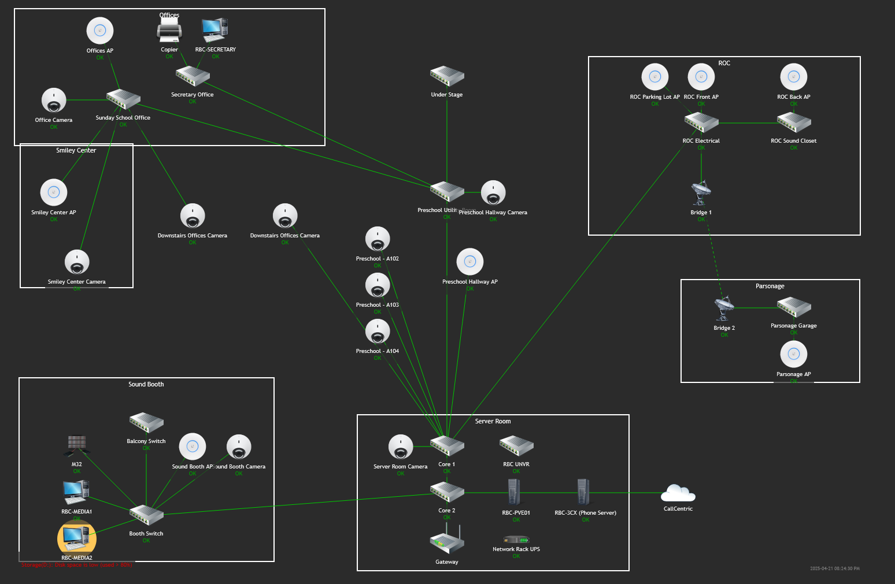

## My Monitoring Systems Overview

One of the main projects I like to work on with my homelab and now into some production usage is monitoring. Once I started self-hosting some applications and websites, I knew I wanted to make sure they were always available and working, thus began my journey into the world of monitoring systems. 

It seems like a boring topic, checking if something is working or not, but to me it's kind of a game of how much data can I pull and monitor? I've been monitoring everything from website uptime, to network utilization, to battery and power status, and even to copier toner monitoring. Why? Because the data is out there and available.

## How it began: Uptime Kuma

The very first monitoring system I set up is a project called Uptime Kuma. (https://github.com/louislam/uptime-kuma). This is a simple web app primarily designed for ping-based monitoring. Its primary function is to perform basic checks to determine if something is up or down.

This monitoring system can be utilized to check if a location’s internet connection is up or to ensure that a website is accessible. Below is an example of a monitor that pings my church’s WAN IP every minute to alert me when it goes down. 

Below is an alert from where a WAN connection monitor went down and sent an alert to my phone. 

Uptime Kuma can also do other monitors such as checking a website for a specific word or phrase to make sure it is there, or checking specific ports. 

For instance, I use Uptime Kuma to monitor a radio system for my radio club. We employ a system called Echolink, which essentially hosts a radio at my house on the internet, enabling other radio operators to communicate on our repeater. The Echolink system has a webpage that lists all active connections. I can set up a keyword monitor in Uptime Kuma that checks this page and looks for our node number. If the number is absent from the list, it indicates that our node has been disconnected, and I receive an alert. 

## Onto Zabbix

After using Uptime Kuma for a while, I realized I needed to expand my monitoring capabilities. While Uptime Kuma is a great program, it has some limitations. I tried out a few other monitoring suites, but I ended up choosing Zabbix. Zabbix is a free monitoring tool that is incredibly powerful and expandable. 

Zabbix’s ability to be configured as a distributed monitoring system was the primary draw for me. I have a primary Zabbix Server hosted on a cloud VPS in Linode’s Atlanta data center. Additionally, I have Zabbix Proxies set up at my home and church. These are small virtual machines that perform all the monitoring within the network and then report back to the main server. See the diagram below for a visual representation.


graph TD
    %% Top layer
    ZabbixServer[Zabbix Server - Cloud]

    %% Middle layer - Proxies
    HomeProxy[Zabbix Proxy - Home]
    ChurchProxy[Zabbix Proxy - Church]

    ZabbixServer --> HomeProxy
    ZabbixServer --> ChurchProxy

    %% Home network
    subgraph "🏠 Home Network"
        HomeProxy --> HomePC1[PC 1]
        HomeProxy --> HomePC2[PC 2]
        HomeProxy --> HomeSwitch[Network Switch]
    end

    %% Church network
    subgraph "⛪ Church Network"
        ChurchProxy --> ChurchPC1[PC 1]
        ChurchProxy --> ChurchPC2[PC 2]
        ChurchProxy --> ChurchRouter[Router]
    end


This setup offers both flexibility and security. Each location has a proxy that receives data from devices there. The proxy then encrypts the data and sends it to the main server for processing, storage, and alerting. Additionally, each proxy can perform active checks on devices like printers, network switches, and batteries that can’t run a Zabbix agent to report data. 

For church, all our computers are equipped with Zabbix agents that continuously report various data points to the Zabbix system. These data points include uptime, frequency of reboots, and utilization of drive, processor, and memory resources. This comprehensive monitoring system enables me to closely monitor all our production systems, ensuring optimal performance and capacity utilization. 

Zabbix itself offers some impressive reporting capabilities. On the homepage, it displays any alerts that have been triggered across various systems. In the screenshot provided below, an informative alert is displayed about an access point at church that has reached high utilization. Additionally, two warning alerts are shown: one for disk space on a media computer and the other for the toner cartridge in my printer, which is running low.

Zabbix can also create diagrams that visualize networks and identify any issues present at specific points in the map. Below is an overview map of Ridgeview’s network, showcasing all the switches, access points, cameras, and major systems. This comprehensive view provides a quick overview of the network’s wiring and aids in troubleshooting issues more efficiently. Notably, the MEDIA2 PC is alerting for the disk space issue. 

## Little bit of Grafana

Zabbix can give good insights into alerts, but it doesn't present data too nicely and that is where Grafana comes into play.

Grafana is made to take in multiple sources of data and make pretty graphs and diagrams out of it. There are several data sources that I use for Grafana including pulling data right from Zabbix, querying MySQL databases, and even websites and other data feeds.

## Tactical RMM

## Wazuh

## Injesting info