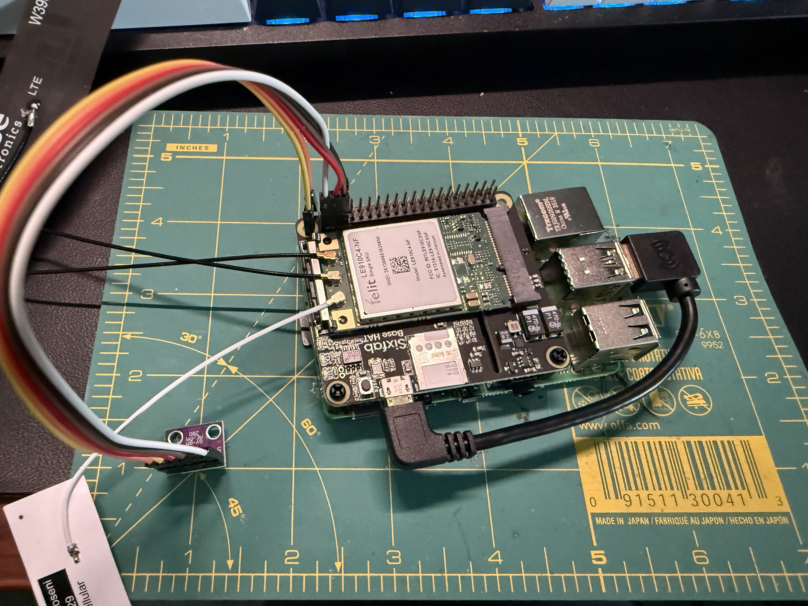
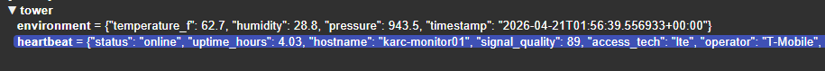
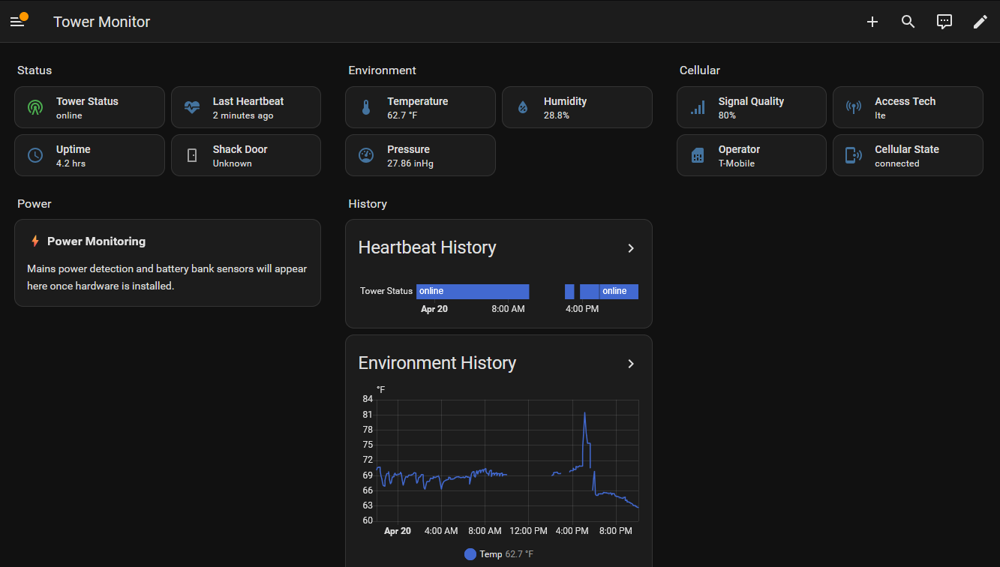
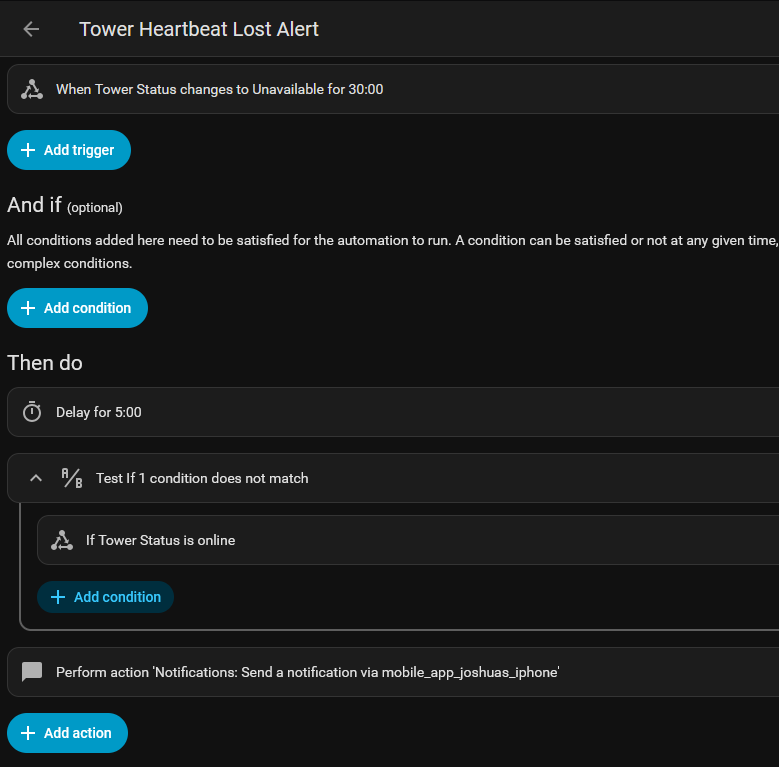
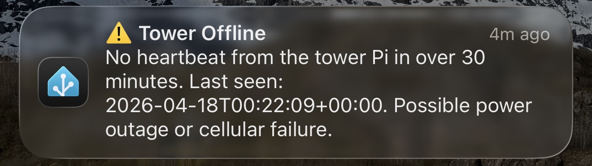
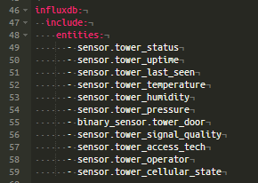
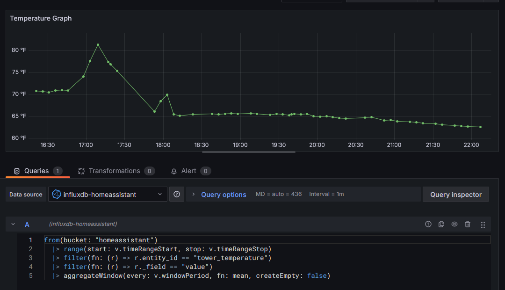
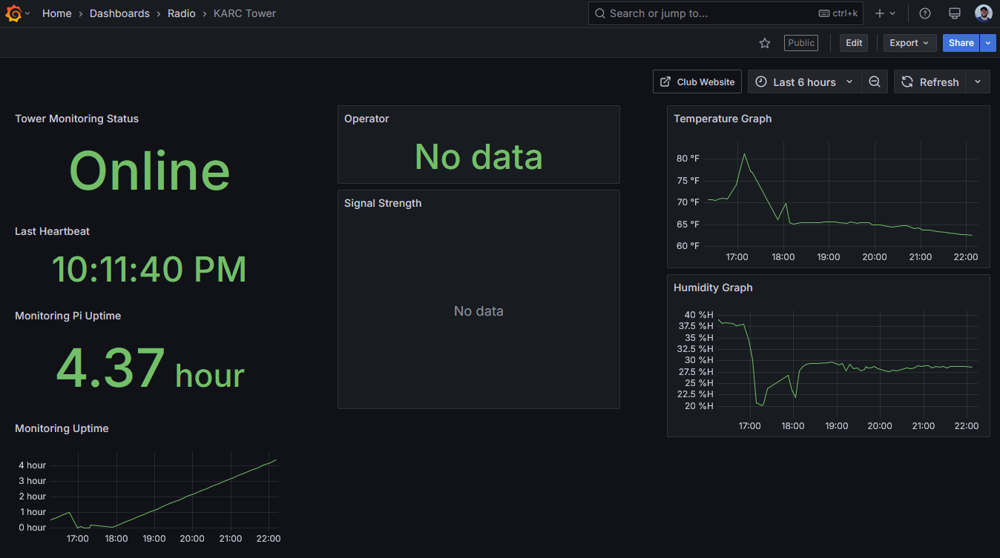

Earlier this year we had some power issues at the [Kingsport Amateur Radio Club](https://w4trc.org/) tower located on Bays Mountain. We would notice at random times, our repeaters would be offline. The tower is a 30 minute drive up a service road from Bays Mountain park, so by the time we were free and could run up there, they would be online again. 

To figure out why this was happening and get better alerting on when it does happen, I decided to build a Raspberry Pi shack monitor that has 4G connectivity and can let us know when the shack power is down.

My main requirement for this project was that it be self-contained and standalone from any infrastructure other than power. This meant it needed to be on a 4G data connection for sending its checks and telemetry. For this reason I chose a Raspberry Pi with a SixFab IoT 4G card.

## Parts List

I sourced all of my parts from Amazon for the quick delivery as I wanted this built in just a few days so we could deploy it on the next trip up to the tower.

- [Raspberry Pi 4B](https://www.amazon.com/dp/B07TD42S27)
- [SixFab 4G Hat](https://www.amazon.com/dp/B089X8N2TY)
- [BME280 Sensor](https://www.amazon.com/dp/B0GRRDXGH8)
- USB C Power Adapter
- MicroSD Card

## Hardware Setup

To begin with the hardware setup it is pretty easy, unbox all of the parts and start assembling the main Raspberry Pi board. Add the SixFab 4G hat, install the PCIe card, connect the antennas, insert the SIM card, and plug in the USB cable.

For the temperature sensor this took a bit more work. First I had to solder on the 6 pin header to the module and then connect the 4 cables needed for I2C communications to the Pi.

Once everything was connected, it was time for the software. 

## Software Setup

For the software side of the project, I wanted it to work a certain way. I have been learning MQTT messaging recently and knew it was a very lightweight and data efficient way of sending a bit of data across the internet. So for this project I could send an MQTT message from the Pi to my home MQTT broker running EMQX. From there this data could flow into [InfluxDB](https://www.influxdata.com/) for long term storage, into [Home Assistant](https://www.home-assistant.io/) for alerting, and into [Grafana](https://grafana.com/) for graphing. These parts of the setup I already have in place, so it made sense to go this route.

### 4G Connectivity

One of the first things I needed to get working was the 4G connectivity. SixFab provides Internet of Things (IoT) data plans for this exact purpose. They have pay as you go plans or you can buy blocks of data. Since this project is very simple, I decided to just use a pay as you go plan and cap it at 100 MB per month so it would not go over that. 

SixFab makes this whole system very simple to set up. You simply register for an account on their platform, add the SIM card info, choose your provider (I chose T-Mobile), and activate the plan. Buying their 4G hat also gives you a free $25 credit which should last me several months.

I also added Tailscale so I could SSH into this Pi while it was at the shack. This has already come in handy for making small modifications to the script.

### Python Script

For the software, I did enlist the assistance of Claude Code. It is a very simple Python script and the GitHub repo is below.



The main part of this code is a simple script that does a health check every 10 minutes and sends it to my MQTT broker for distribution. The script collects a few pieces of data from the Pi itself such as uptime and cell signal, and it also gets data from the BME280 sensor for temperature, humidity, and barometric pressure. Once it gets all of this data together, it makes a simple message and sends it out. This data is only about 0.2 MB per day of traffic coming from the Pi. 

### MQTT Reception

The data gets received by the MQTT broker running on my server at home. Think of the MQTT broker as a bulletin board, the Pi sends its telemetry and it gets put on the bulletin board for anyone else to see it. 

An example of this data is below. This data is shown in a program called MQTT Explorer, which is a great tool for seeing realtime data and verifying that it is working properly.

Once we have the telemetry in MQTT we can begin using it for our different pieces.

### Home Assistant

The main piece that I wanted this data for, was Home Assistant. Home Assistant (HA) is a home automation platform that I use for some smart home devices, but one of the neat things it can do is ingest this MQTT data, show it on dashboards, and give alerts off of it. With the help of the Claude Home Assistant MCP, I was able to have it generate a quick dashboard showing all of the statistics that the tower Pi was sending.

From this, I can get a quick overview of what is going on. 

Once I know the data works, we can begin creating some automations. The first I wanted to do is get an alert if we haven't heard from the Raspberry Pi in 30 minutes. If it stops sending the data, we can assume that the power is offline, or the Pi has an issue. This at least gives us an alert to check the repeaters and see if they are working. To do this, we do a simple check for when the Tower Status sensor changes to Unavailable for 30 minutes, and then we wait 5 minutes to make sure it is still offline and then send the alert. 

We also do this in reverse, if the status changes from Unavailable to Online, we send an alert that it is back online.

Once this is set up, and the Pi is not sending data I get an instant alert straight to my phone.

### InfluxDB

To store this data, I wanted to send it to InfluxDB which is a time series database. It basically can store any data over time and let other programs search and see the data changes over time. There are several ways of getting this data into InfluxDB, but I decided to have Home Assistant do it. Mainly because I already send some data from HA to InfluxDB for long term storage. To add these sensors, we just add a line in the config to send them to the InfluxDB bucket.

One of the nice things about InfluxDB, is that it can purge data on a time schedule. So I am only keeping this data for 90 days. I may end up extending this to a year so we can see temperatures in the shack over a year, but 90 days is a good start.

Once this config is added, we are now storing this data for viewing.

### Grafana

Once the data is in InfluxDB, it can be added as a Data Source in Grafana, which is a popular graphing and visualization platform. It can take in a lot of data from many different sources, and show a dashboard of it.

Since Claude Code knew all of the data that was being passed around this project, it was simple to create queries to view the data we are collecting and storing. 

A query is just looking up data from the bucket of data in InfluxDB. We can make several of these graphs and then create a dashboard of all of it.

I started out making this for a public view of the data to share with the club, but decided to try a new way and ended up not publishing the Grafana page publicly, but you can view it [here](http://grafana.jclab.xyz/public-dashboards/f29f1312a55e4201be5ace5f0d25c1a3).

### Club Website

Beyond my own monitoring, I decided to try and embed this data into the club's website which is developed in Astro. Astro can load JavaScript and I found that there is a way to add an MQTT client into JavaScript. With Claude Code's help, we created an Astro Component and added it to the website. This data can be found at https://w4trc.org/repeaters/dashboard/

The MQTT broker will hold onto the last message received, but we do some simple checks to see if the data is older than 30 minutes or not. If the data is less than 30 minutes old, it will be shown on the site and any new heartbeat message will be automatically shown. If it is old data, the site will show a message about the monitoring system being offline. Hopefully if you go to it, the system is online and you will see the data.

## Conclusion

Overall, this was a simple project and now allows us to track some data about our repeater shack on top of Bays Mountain. With this data, we can make more informed decisions about the status of everything and this opens the door for us to expand the monitoring capabilities. There are a few things we want to add on, such as a proper outdoor weather station, battery and solar charging system monitoring, and more. Stay tuned for that coming soon.