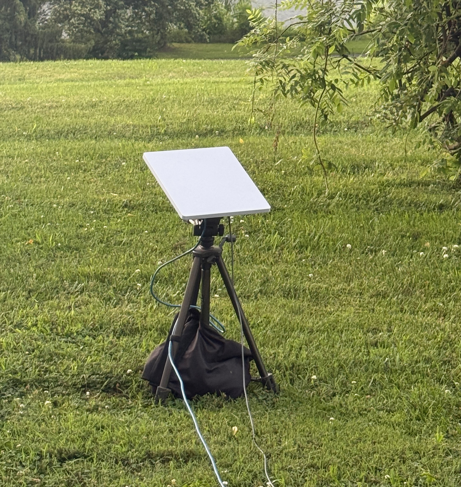
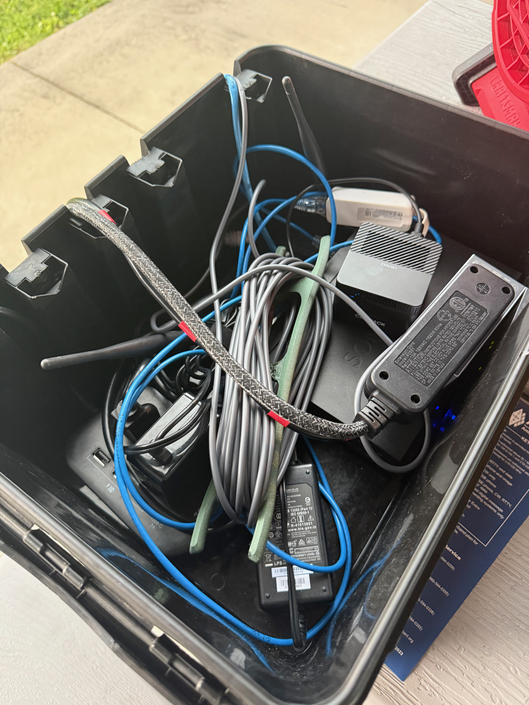
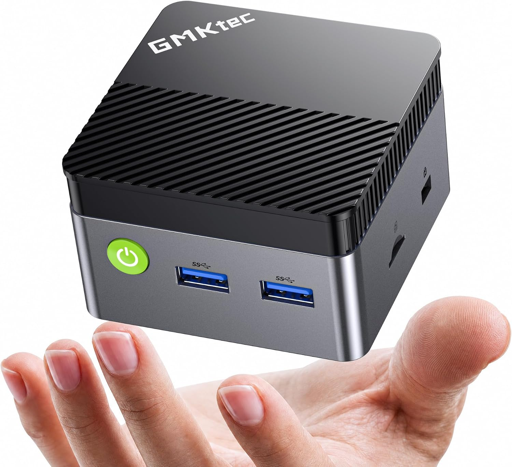
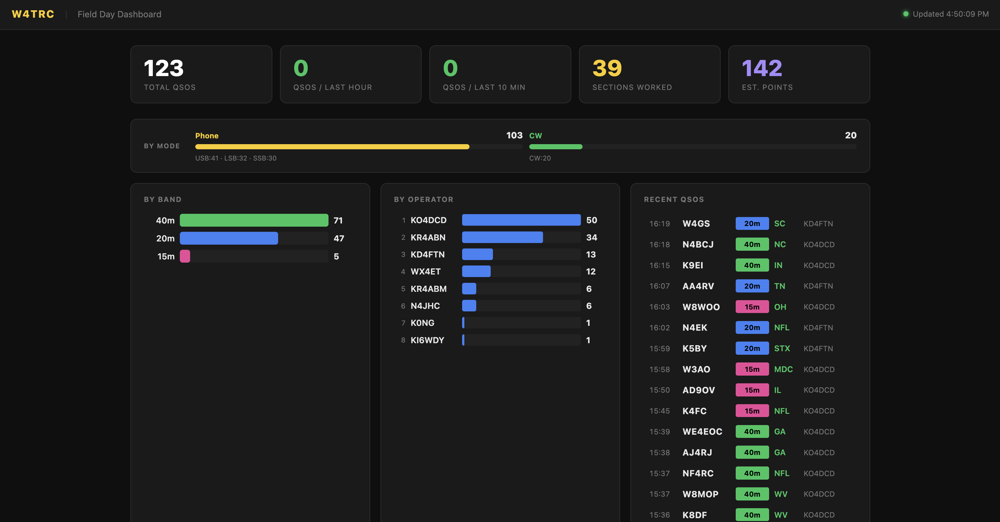
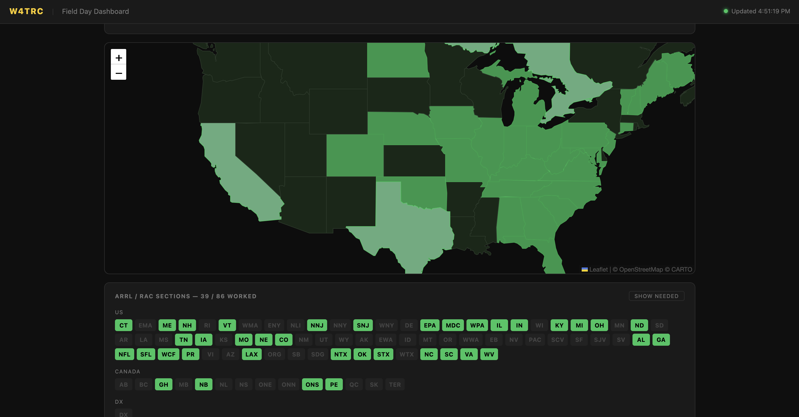
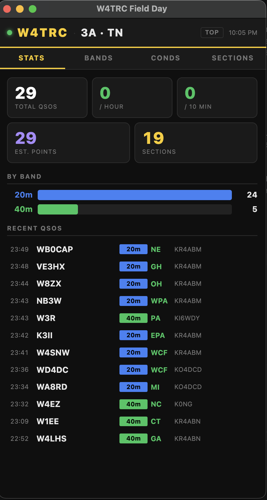
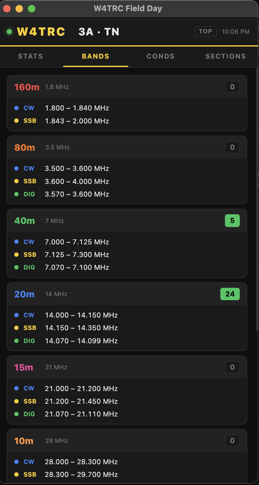
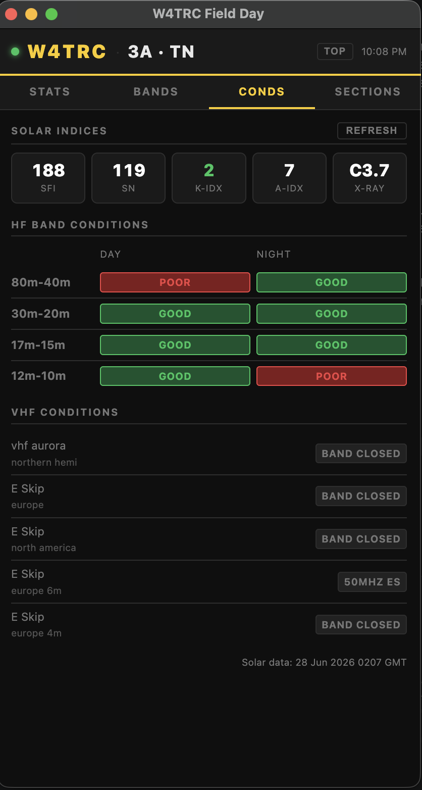
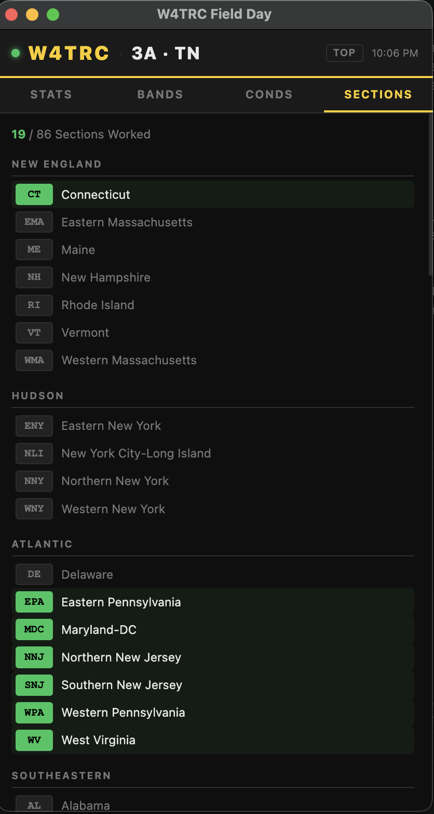
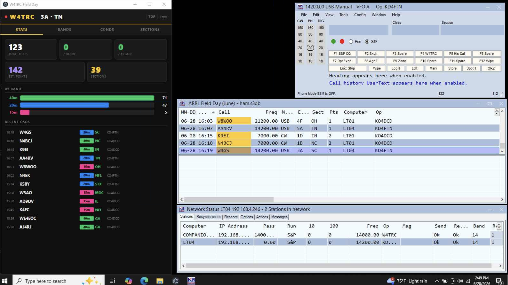

Every year, [Kingsport Amateur Radio Club ](https://w4trc.org/) participates in the American Radio Relay League (ARRL)'s Field Day event. During this event radio clubs and operators across the US set up, test their emergency equipment, and operate for 24 hours. We normally set up somewhere in Kingsport and operate up to 3 radio stations as much as we can.

For this event, we utilize computerized logging software to track other stations that we contact. We use this to compile our contacts and submit our logs to the ARRL. As part of this, part of my job is to set up the logging systems and this year we changed it up a bit.

## Last Year

Our setup last year was pretty simple. I keep a few spare laptops on hand ready for events like this and we used a simple wireless router to have a local area network (LAN) for them to communicate on. We used logging software made by N3FJP, which works well, but I wasn't a big fan of how it would work in a multi-station setup. Because of this I wanted to try some new logging software. Once I learned how it worked I had some ideas of how to expand on it.

## This Year

For this year, I took this a step further. This year we had a working internet connection, used some different logging software, and had some custom made software that communicated with this logging system.

### The Internet Connection - Starlink

This year, we got a Starlink dish to provide internet access at our field day location. We set up at Netherland Inn and would not have any public internet access. Internet is not necessary for this event, but it is just another communication method we could deploy in emergencies so I wanted to test that out. 

Our setup was really simple, I used a Starlink Mini on a Roam plan which provided up to 100 Mbps download and 20 Mbps upload speed which was plenty for our small network. I set this up on a small tripod and ran a power and ethernet line to it. 

The Starlink Mini is a fantastic piece of equipment and we could run this off of a generator or battery power if needed.

### The Network - Old Sonicwall Firewall

Because I placed the Starlink away from the shelter where it would have a clear view of the sky, I wanted to use a different router and wireless access point closer to where the computers would be. For this, I used an old Sonicwall firewall that I had in my spare IT kit. 

You can place the Starlink in bypass mode, which disables its own built-in router and lets your external router handle DHCP/DNS and routing. From there I was able to broadcast a wireless network.

This equipment lives in a small waterproof box that we sit to the side.

### The computers

I set up 4 PCs that we use for logging. These are just some basic Lenovo and HP laptops running Windows. They are all connected to the wireless network and one is placed beside each radio with a spare just in case we need one.

### The "Mini Server"

I run a Mini PC as our "Mini Server". This is a small Windows PC that hides in the network equipment box that is near our logging area. This was the file share host for N3FJP and this year functioned as the primary log in N1MM and hosted the sending agent to send our logs to our website, which I will cover later in this post. This PC also was my remote host that let me connect to the network while away from the field day location.

### The software - N1MM Plus Logger

Previously we have used N3FJP logger which I am a fan of, but I wanted to try something new this year.

My main issue with N3FJP is it operates with one computer having a master log and it shares this file over SMB to the other computers. In the past I have used the Mini Server which has a file share that this log file lives in. This was designed so we could reboot the laptops if needed or swap them around and have no issues with the log file.

N1MM networked mode works a little bit better in my opinion. Each computer maintains its own SQLite database for the log file, but broadcast each contact it makes over multicast. This lets each other computer add the contacts other computers make into its log. We do this for duplicate detection, as in field day you are not supposed to contact the same station on the same band and mode, or it is a duplicate contact. Networking the computers together makes this duplicate detection work no matter what computer the contact was made on.

N1MM just feels more robust to me, as any computer can drop offline, even our "master" of the Mini Server and the other computers will still have their logs and resync when the others come back online.

Because N1MM broadcasts any contacts that are made over the network, this gave me the idea of being able to capture these contacts and make a public dashboard on our website.

### The Sending Agent

Since N1MM does UDP broadcasting of any contacts, I built a small NodeJS application (with Claude AI's help) that listened for these UDP messages and forwarded them to our website. This submitted each contact to a Cloudflare Worker that would parse the contact and store it in a D1 SQL database on Cloudflare. This served as a place to view the logs publicly, but also served as a tertiary backup of all of our contacts that were stored off site in case there were any issues with our logging PCs.

This agent is open source and available at https://github.com/w4trc/contest.w4trc.org. 

### The Website Dashboard

That same Cloudflare worker had a public dashboard at https://log.w4trc.org which anyone could visit during Field Day and see live stats. The worker would query the D1 database and show some statistics such as current contact (QSO) count, what bands the contacts were made on, who made the contacts, and what sections we had contacted. 

Another reason this architecture was decided on was this allowed use of the Starlink connection to be used to send basic info to Cloudflare and the data and viewing is all in Cloudflare's world and not having to tunnel back to the site over the Starlink connection.

### The Desktop App

Another part I added to this system was a simple desktop Electron app to view this data and more reference data on the logging computers. 

The main page I wanted was the stats page.

My main issue with N1MM was it did not show a lot of statistics while operating. It was hard to find total number of contacts so I wanted a quick view of how many contacts we were making and how many points (different modes are worth different points in Field Day). 

I also added a few other pages such as a band plan for reference.

This was to show operators what frequency ranges were available for what amateur bands.

Another page I added was a conditions page. Amateur radio waves are heavily affected by the sun and solar conditions can change at any time. So I wanted a quick page that pulls in the current solar conditions from https://www.hamqsl.com/solarxml.php and shows them easily.

The last page I added was the sections list.

As part of the Field Day radio exchange, we trade our section. For us, our section is TN for Tennessee. Larger states like Texas may be broken up into North Texas (NTX) or South Texas (STX) and sometimes we can't remember all of the sections like SCV which is Santa Clara Valley in California. This page lists all of those and shows them in green if we have contacted that section.

All of this sits on the desktop to the left of N1MM logging software and completes our Field Day logging setup.

### Reporting

After the event is over, N1MM packages up all of the logs and contact details for me to upload to the ARRL website.

This year we made 123 total contacts over 24 hours of operating. 

## Review

From a logging standpoint, I think this was the best year so far. The N1MM logging software worked really well and was super easy to set up and run. Having Starlink access and our custom dashboard was a really nice addition. We only used 3.2 GB of data on the Starlink, so I will probably run it in standby mode next year which provides internet but is capped at 0.5 Mbps upload and download speed. This should be plenty for the data we are using. 