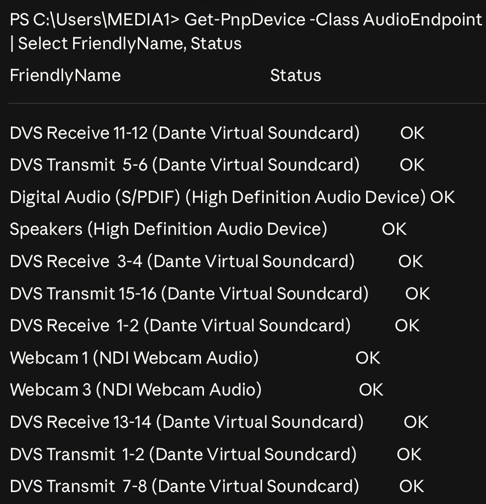
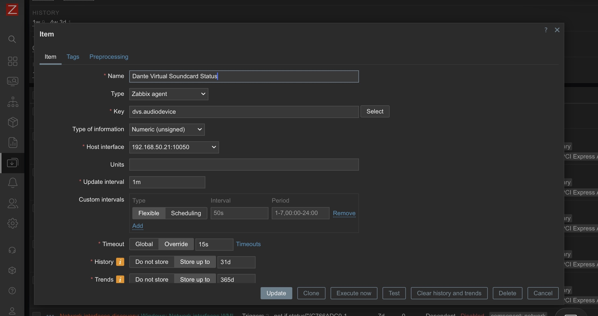
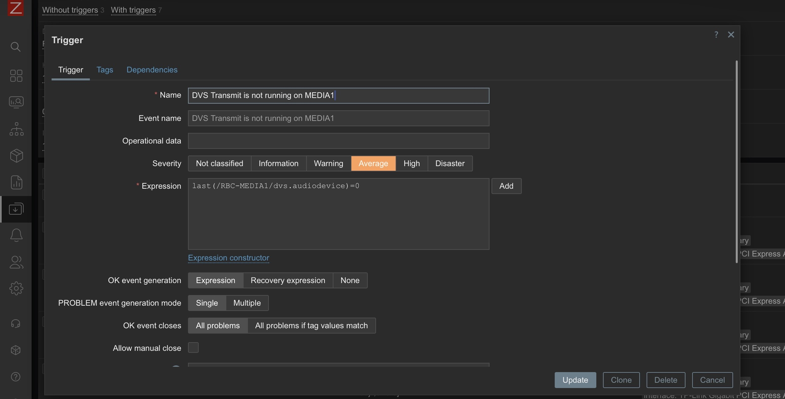

## Intro

One of the tools we use at church is Dante Virtual Soundcard. Dante is a protocol created by Audinate that allows sending of audio over standard network cabling and equipment. Dante Virtual Soundcard (DVS) is one of the ways you can get audio into a Dante network and is a piece of software that we run on our production computers and allow us to send audio over our network to any other production computer or our sound board. This offers us a ton of flexibility in sending audio anywhere without running additional cabling.

One of the main uses for this is for our slides computer (MEDIA1) to send its audio to our sound board for music or video playback.

## The Problem to Solve

Occasionally, this Dante service does not start automatically on reboot. I wanted to get alerts if it is not running. I use Zabbix for all of my monitoring, so I needed to figure out how to make it monitor Dante Virtual Soundcard.

## Attempt #1 - Monitoring the service

I realized that DVS runs as a service on the production computer so I set up a simple Zabbix monitor to check if this service was running. In my testing I realized this would not work. The service can be running but "stopped" so audio is not passing. DVS has its own internal started/stopped state separate from the Windows service. The service process can be alive but DVS itself can be in a stopped state, meaning no audio is flowing.

## Attempt #2 - Monitoring the network ports

Another easy way for Zabbix to monitor things is through monitoring a network port. Zabbix can easily check any ports that are listening on the computer. The problem with this is that the ports can change and there are a bunch of ports DVS uses (UDP 4440, 319, 320, plus dynamic ranges).

## Attempt #3 - Monitoring the audio device

My final attempt was monitoring the audio device in Windows itself. When DVS is running and started, it will show the audio devices.



When DVS is stopped or not running, it will show the DVS Transmit channels but show them as Unknown. This is the easy way of telling if DVS is running.

Zabbix agents support custom checks called UserParameters. You define them in the agent config file on the monitored machine, and Zabbix can then query them like any built-in check. So then we can simply add a line like this to our monitored computer's Zabbix configuration file 

```powershell
UserParameter=dvs.audiodevice,powershell -NoProfile -Command "@(Get-PnpDevice -Class AudioEndpoint | Where-Object { $_.FriendlyName -like '*Transmit*1-2*Dante*' -and $_.Status -eq 'OK' }).Count"
```

This checks for the audio device for Transmit 1-2 Dante and only if they are OK, not Unknown or disconnected. This returns the count, either 0 for no "OK" devices found, or 1 for the device being found.

In Zabbix, create a new item on MEDIA1 with type ‘Zabbix agent’, key dvs.audiodevice, and a 1-minute update interval.



From this, we can add an item in Zabbix on this host to check that parameter every minute and know if DVS is running or not.

Once we have this data in Zabbix, we can create a trigger based on this data.

```
last(/RBC-MEDIA1/dvs.audiodevice)=0
```

If the last time it checks the audio device, it sees no DVS output, it triggers a high level alert.



This can also show in our system status dashboard and let us know as soon as the issue occurs and takes a lot of guesswork out of troubleshooting.

## Conclusion

This was a simple addition to add, but can save us a lot of time and troubleshooting by not having to wonder why we don't have audio. We are able to catch this issue before it has any chance of impacting service and can be an easy fix. I'm always looking for ways to make our technology setup better and this kind of thing is what ties it all together.